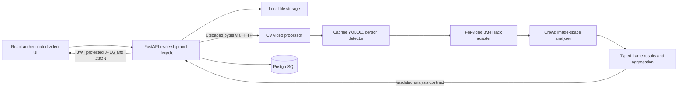

# Architecture

## Current pipeline

The backend owns authentication, upload limits, ownership, safe errors, storage, validation, and persistence. Only the CV service imports Ultralytics or performs tracking.

## Phase 5 boundaries

- `detection/detector.py`: cached lazy model, serialized CPU prediction calls, person-only filtering.
- `tracking/config.py`: validated small ByteTrack configuration surface.
- `tracking/tracker.py`: retained person boxes to Ultralytics Boxes, then BYTETracker. No image/appearance features are supplied.
- Each analysis constructs a new adapter. The pinned Ultralytics 8.4.152 `track_class` extension point supplies an STrack subclass with a closure-local allocator. This avoids upstream's global BaseTrack counter, including resets and interleaved videos. Actual tracker IDs are returned without relabeling.
- `video/processor.py`: chronological decoding, union of detection/tracking sample schedules, single inference per required frame, original frame indexes/timestamps, representative annotated JPEG, and unconditional capture release.
- `tracking/aggregation.py`: confirmed observed tracks, histories and metrics. Lost/predicted-only tracks are excluded from active counts.
- `tracking/schemas.py`: typed JSON contract. The backend mirrors this small deployment-independent schema; a regression test requires identical files.
- `backend/app/schemas/analysis.py`: rejects unknown internal fields, invalid numbers/IDs/boxes, incorrect counts, timing, incomplete frames, inconsistent histories and trajectories.
- `video_processing.py`: validate before committing results; rollback partial analysis and remove newly written preview on failure.

## Persistence decision

Migration `20260915_04` adds nullable `videos.tracking_analysis` JSON alongside existing Phase 4 JSON columns. Older migrations remain unchanged; old rows need no backfill. A single versioned document preserves atomic analysis and cascade-by-video deletion. This matches current detection storage and avoids a premature multi-table system. Future spatial queries or large histories can move to indexed JSONB or normalized observation tables through a new migration.

Per-frame objects contain frame index, timestamp, active count and tracked persons (ID, pixel box, confidence). A person's frame/time is inherited from its containing frame to avoid redundant payload. Histories include first/last frame and timestamp, observation count, average score, and timestamped normalized center points. These are image-space observations, not physical distances.

Tracking summaries retain tracker settings and carefully named metrics. Distinct IDs are not verified individuals. IDs may be nonconsecutive because unconfirmed tracks can be discarded before observation. ByteTrack buffer units are processed tracking frames, and no observations are synthesized for skipped frames.

## Operational boundaries

The detector is shared and locked, while motion state and ID allocation are per-video. Worker processes can use the same orchestration boundary later. Synchronous HTTP, JSON-in-row storage, whole-response transfer, and full trajectory rendering are intended for short clips. Future queue/recovery/retention work is separate; no Redis or Celery is added here.

## Phase 6 extension

The CV crowd module consumes the existing tracked observations in the same processing pass, with no new inference or decoding. Migration 20260915_05 adds nullable crowd_analysis JSON. The backend validates its versioned contract, frame alignment, statistics, peaks and operational categories before atomic persistence. The owner-protected frontend renders count and image occupancy timelines, level distribution, and trend. See [full formulas and contract](crowd-analysis.md).

## Phase 7 extension

The backend derives heatmaps and zone counts from persisted tracking frames using
one canonical spatial geometry implementation. A new upload stores its heatmap
atomically with existing analyses. Zone CRUD recalculates only geometry, with no
CV HTTP requests. Migration `20260916_06` adds video heatmap JSON and a cascading
video-owned monitoring-zones table. The frontend uses normalized SVG overlays,
an authenticated preview and persisted zone summaries/timelines. Read the
[spatial contract and design decisions](spatial-analysis.md), including inactive
zone semantics, overlapping zones and deferred occupancy/dwell metrics.

## Phase 8 extension

The backend alert engine consumes persisted crowd and zone frames, segments qualifying intervals and transactionally stores bounded evidence. Video row locks serialize rule and spatial writes. Rule deletion preserves snapshot history; video deletion removes it. Read [alert engine](alert-engine.md) for contracts and operational risk semantics.
# Live session architecture

Phase 9 adds camera-owned configuration and persistent live sessions independently
of uploaded videos. Browser binary frames pass through backend ownership checks to
the CV worker's session-local ByteTrack; backend geometry and incremental rules
produce persisted REST snapshots/events. See [live monitoring](live-monitoring.md)
for the complete contract, bounds, restart recovery, and single-process limitation.
