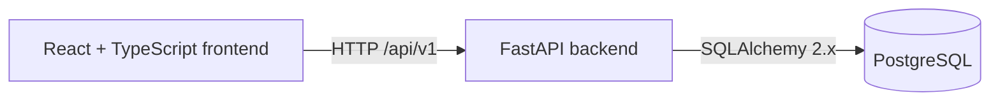

# Architecture

Phase 1 establishes independent deployment boundaries without implementing computer vision or real-time processing.

The planned future flow is intentionally not implemented:

The frontend owns presentation, navigation, client state, and the typed API boundary. FastAPI owns validation, orchestration, domain services, and persistence. The CV service is a separate future compute boundary. Aggregate monitoring is the project goal: facial recognition and biometric identification are out of scope.
